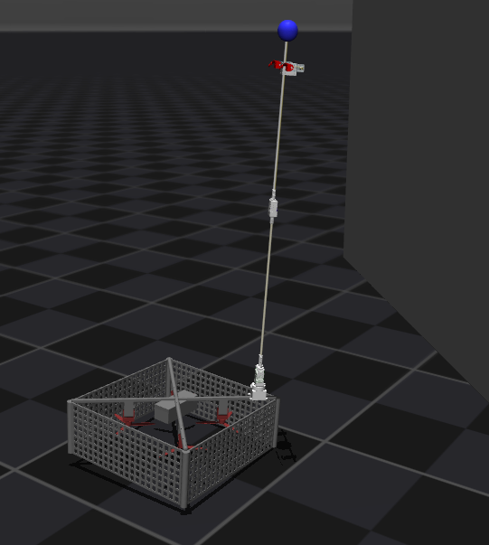
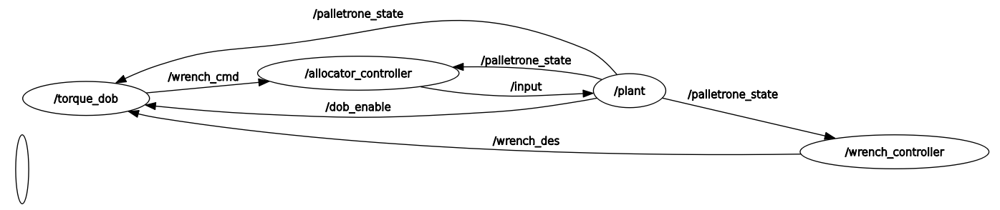

</head>
<body>

<h1>Tpam Simulator</h1>

<section>
  

    This project is developed by <a href="https://mrl.seoultech.ac.kr/index.do" target="_blank" rel="noopener">SeoulTech MRL</a>
  

  

 <strong>Thrust-Powered-Manipulation</strong> with Palletrone
  

</section>

<h2>Node Structure</h2>

<section>
  <pre><code>Tpam_simulator/
└── src/
	├── MUJOCO_LOG.TXT
	├── palletrone_cmd
	│   ├── CMakeLists.txt
	│   ├── launch
	│   │   └── pt_launch.py
	│   ├── package.xml
	│   ├── scripts
	│   │   └── teleop_position_node.py
	│   └── src
	│       └── position_cmd.cpp
	├── palletrone_controller
	│   ├── CMakeLists.txt
	│   ├── package.xml
	│   └── src
	│       ├── allocator_controller.cpp
	│       ├── torque_dob.cpp
	│       └── wrench_controller.cpp
	├── palletrone_interfaces
	│   ├── CMakeLists.txt
	│   ├── msg
	│   │   ├── ArmCmd.msg
	│   │   ├── Cmd.msg
	│   │   ├── Input.msg
	│   │   ├── PalletroneState.msg
	│   │   └── Wrench.msg
	│   └── package.xml
	└── plant
	    ├── package.xml
	    ├── plant
	    │   ├── __init__.py
	    │   └── plant.py
	    ├── resource
	    │   └── plant
	    ├── setup.cfg
	    ├── setup.py
	    └── xml
		├── arm_assets
		│   ├── 6prop.stl
		│   ├── case_bearing.stl
		│   ├── LINK1_honebracket_540_under.stl
		│   ├── LINK2.stl
		│   ├── LINK3_xm430_to_Wrist.stl
		│   ├── MujocoLink2.stl
		│   ├── Wrist_Link.stl
		│   ├── XC_330_bracket.stl
		│   ├── XC_330_Parts.stl
		│   ├── XC_330_servo.stl
		│   ├── XL540.stl
		│   └── XM,H-430_idler.stl
		├── BODY.stl
		├── Palletrone.xml
		├── PROP.stl
		├── scene.xml
		└── STLchanger.py

</code></pre>
</section>

</body>
</html>
