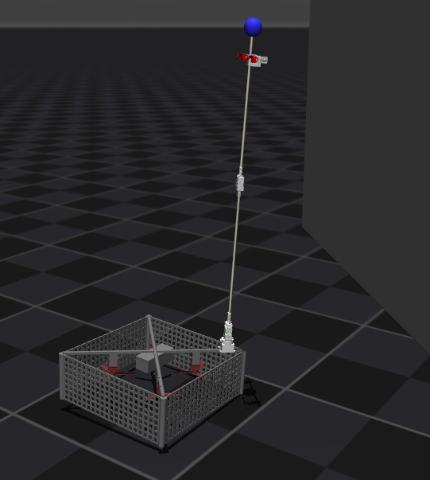
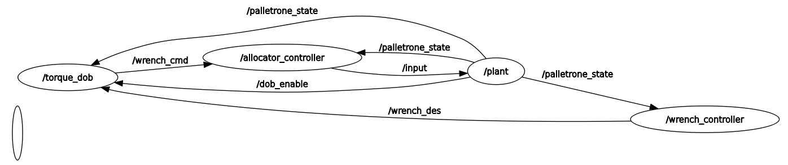

</head>
<body>

<h1>Tpam Simulator</h1>

<section>
  

    This project is developed by <a href="https://mrl.seoultech.ac.kr/index.do" target="_blank" rel="noopener">SeoulTech MRL</a>
  

  

 <strong>Thrust-Powered-Manipulation</strong> with Tpam
  

</section>

<h2>Node Structure</h2>

<h2>Code Structure</h2>

<section>
  <pre><code>Tpam_simulator/
├── README.md
├── images/
│   ├── T-pam.png
│   └── node.png
└── src/
    ├── plant/
    │   ├── plant/
    │   │   └── plant.py
    │   ├── xml/
    │   │   ├── scene.xml
    │   │   ├── Tpam.xml
    │   │   ├── BODY.stl
    │   │   ├── PROP.stl
    │   │   └── arm_assets/
    │   ├── setup.py
    │   └── package.xml
    ├── tpam_controller/
    │   ├── src/
    │   │   ├── wrench_controller.cpp
    │   │   ├── torque_dob.cpp
    │   │   └── allocator_controller.cpp
    │   ├── CMakeLists.txt
    │   └── package.xml
    ├── tpam_cmd/
    │   ├── launch/
    │   │   └── pt_launch.py
    │   ├── scripts/
    │   │   └── teleop_position_node.py
    │   ├── src/
    │   │   └── position_cmd.cpp
    │   ├── CMakeLists.txt
    │   └── package.xml
    └── tpam_interfaces/
        ├── msg/
        │   ├── ArmCmd.msg
        │   ├── Cmd.msg
        │   ├── Input.msg
        │   ├── TpamState.msg
        │   └── Wrench.msg
        ├── CMakeLists.txt
        └── package.xml
</code></pre>
</section>

<h2>Packages</h2>

<section>
  <ul>
    <li><strong>plant</strong>: MuJoCo model loader and simulator node. It loads <code>scene.xml</code>, opens the MuJoCo viewer, subscribes to actuator inputs, and publishes TPAM state.</li>
    <li><strong>tpam_controller</strong>: controller nodes. It contains the wrench controller, torque DOB, and thrust/servo allocator.</li>
    <li><strong>tpam_cmd</strong>: command and launch package. It provides the integrated launch file, keyboard teleop node, and a simple position command node.</li>
    <li><strong>tpam_interfaces</strong>: custom ROS 2 messages used by the simulator and controllers.</li>
  </ul>
</section>

<h2>Build</h2>

<section>
  <pre><code>cd ~/ros2_project/Tpam_simulator
colcon build --symlink-install
source install/setup.bash
</code></pre>
</section>

<h2>Usage</h2>

<section>
  
Start the simulator and controllers:

  <pre><code>ros2 launch tpam_cmd pt_launch.py</code></pre>

  
This launch file starts:

  <ul>
    <li><code>plant</code>: MuJoCo simulation and state publisher</li>
    <li><code>wrench_controller</code>: converts position/attitude command to desired wrench</li>
    <li><code>torque_dob</code>: disturbance observer between desired wrench and allocator command</li>
    <li><code>allocator_controller</code>: converts wrench command to motor speed and servo angle input</li>
  </ul>

  
Run keyboard position command in another terminal:

  <pre><code>cd ~/ros2_project/Tpam_simulator
source install/setup.bash
ros2 run tpam_cmd teleop_position_node.py</code></pre>

  
Keyboard commands:

  <ul>
    <li><code>w / s</code>: x position + / -</li>
    <li><code>a / d</code>: y position + / -</li>
    <li><code>r / f</code>: z position + / -</li>
    <li><code>q / e</code>: yaw + / -</li>
    <li><code>t</code>: roll +</li>
    <li><code>g</code>: pitch +</li>
    <li><code>o</code>: torque DOB on/off</li>
    <li><code>x</code>: reset attitude command</li>
    <li><code>space</code>: reset x, y command</li>
  </ul>
</section>

<h2>Main Topics</h2>

<section>
  <ul>
    <li><code>/cmd</code>: position and attitude command</li>
    <li><code>/Tpam_state</code>: simulator state from MuJoCo plant</li>
    <li><code>/wrench_des</code>: desired wrench from controller</li>
    <li><code>/wrench_cmd</code>: DOB output wrench command</li>
    <li><code>/input</code>: motor speed and servo angle command to plant</li>
    <li><code>/dob_enable</code>: torque DOB enable flag</li>
    <li><code>/dob_dhat</code>, <code>/dob_dhat_used</code>: estimated and applied disturbance torque</li>
  </ul>
</section>

</body>
</html>
